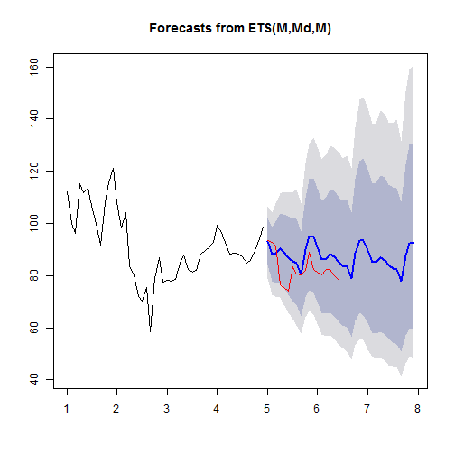

Developing Data Products - Final project pitch
========================================================
author: Per Rynning
date: 14 June 2016
autosize: true

Introduction
========================================================

The application presented is a submission for the Coursera course *Developing Data Products*. 

The application can be found at:
<https://ahazu.shinyapps.io/Forecaster/>.

User interface
========================================================

The user interface is relatively simple. You need to specify:

- Ticker / Stock symbol
    + You can also specify currencies for forecasting (ex: NOK, SEK or BTC)
- From date 
    + The start date from which you want to pull data
- To date
    + The end date for how long to pull data
- Period to forecast (in months)

Example of output
========================================================

This graph details the **IBM** stock with start date **01/01/2001**, end date **06/06/2016** and has a forecasting period of **36** months. 

Disclaimer
========================================================

Although tempting, please refrain from basing economic desicions (solely) on the output from the stock forecaster. 

The author is not responsible for neither financial ruin, nor unhappiness caused by excessive amounts of money.
